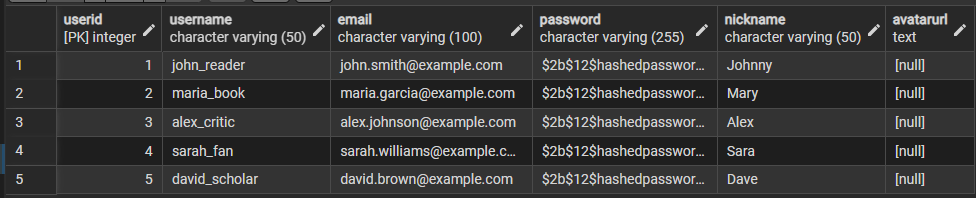
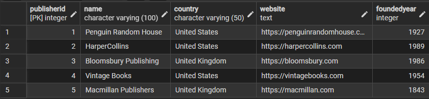
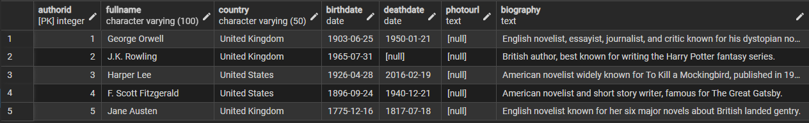
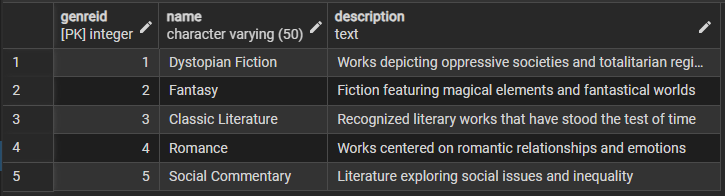
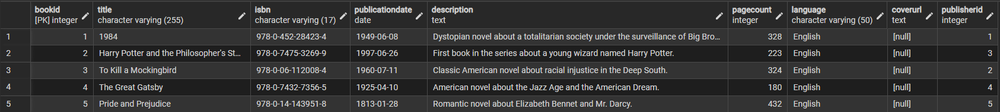
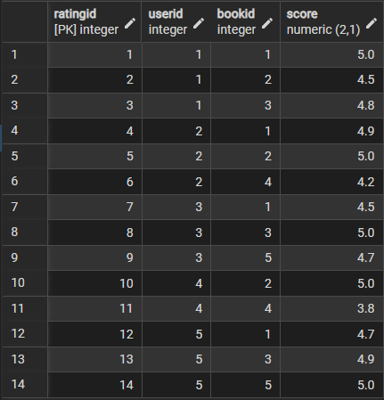
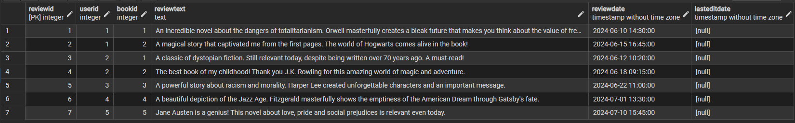
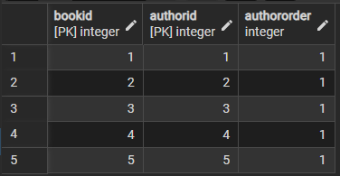
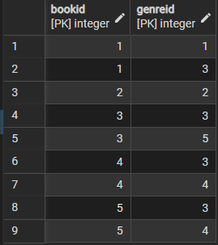

# Лабораторна робота №2  
## Перетворення ER-діаграми на реляційну схему PostgreSQL

---

### Суть роботи

У цій лабораторній реалізовано **перехід від ER-моделі (Лабораторна №1)** до **фізичної реляційної схеми бази даних у PostgreSQL**.  
На основі діаграми з попередньої роботи створено SQL-схему системи **Book Rating System**, що забезпечує всі сутності, атрибути та зв’язки між ними.

**Мета роботи:**  
- створити таблиці згідно з ER-моделлю;  
- визначити первинні й зовнішні ключі;  
- задати обмеження (`NOT NULL`, `UNIQUE`, `CHECK`, `ON DELETE`);  
- заповнити базу прикладними даними;  
- перевірити правильність зв’язків і цілісність даних.

**Посилання на попередню лабораторну, де описані всі зв'язки та таблиці:**
➡️ [Лабораторна робота №1 — Проєктування бази даних для системи оцінювання книг](../Lab_1/README.md)

---

### Структура бази даних

| № | Таблиця | Призначення |
|---|----------|-------------|
| 1 | **Users** | Зберігає користувачів системи (логін, email, пароль, нікнейм, аватар) |
| 2 | **Publisher** | Видавництва (назва, країна, сайт, рік заснування) |
| 3 | **Author** | Автори книг із біографічними даними |
| 4 | **Genre** | Жанри книг із описом |
| 5 | **Book** | Книги з описом і зв’язком до видавництва |
| 6 | **Rating** | Оцінки користувачів (1–5 балів) для кожної книги |
| 7 | **Review** | Текстові відгуки користувачів на книги |
| 8 | **BookAuthor** | Асоціативна таблиця M:N між Book ↔ Author |
| 9 | **BookGenre** | Асоціативна таблиця M:N між Book ↔ Genre |

### Скріншоти таблиць у pgAdmin

#### Таблиця `Users`

#### Таблиця `Publisher`

#### Таблиця `Author`

#### Таблиця `Genre`

#### Таблиця `Book`

#### Таблиця `Rating`

#### Таблиця `Review`

#### Таблиця `BookAuthor`

#### Таблиця `BookGenre`
