# Лабораторна робота №3 
## Маніпулювання даними SQL (OLTP)

У цій лабораторній роботі виконано набір **SELECT-запитів** до бази даних системи оцінювання книг (**Book Rating System**) для демонстрації основних можливостей SQL DML (отримання даних).

---

## Запити SELECT
```sql
SELECT * FROM Users;
```
Повертає всі колонки та всі рядки таблиці Users.

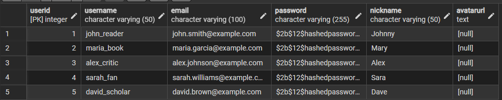

---

```sql
SELECT Username, Email FROM Users;
```
Вибирає лише стовпці Username і Email з таблиці Users.  
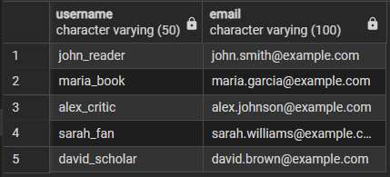

---

```sql
SELECT * FROM Book;
```
Повертає всі колонки та всі рядки таблиці Book.  
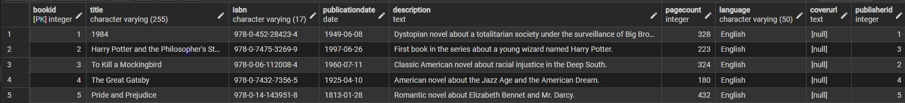

---

```sql
SELECT Title, PageCount FROM Book;
```
Показує назву книги та кількість сторінок.  
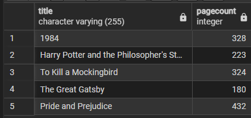

---

```sql
SELECT * FROM Author;
```
Повертає всі колонки та всі рядки таблиці Author.  
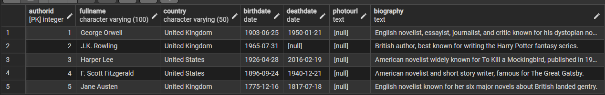

---

```sql
SELECT Title FROM Book;
```
Виводить лише назви всіх книг.  
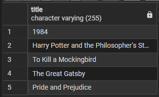

---

```sql
SELECT * 
FROM Book
WHERE Language='English';
```
Відображає книги, написані англійською мовою.  
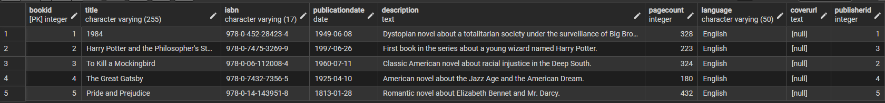

---

```sql
SELECT COUNT(*) AS "Кількість користувачів" 
FROM Users;
```
Рахує кількість користувачів у таблиці Users.  
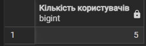

---

```sql
SELECT COUNT(*) AS "Кількість книг" 
FROM Book;
```
Підраховує кількість книг у таблиці Book.  
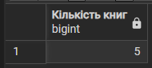

---

```sql
SELECT Title, Language, PageCount 
FROM Book 
WHERE Language = 'English';
```
Показує назву, мову та кількість сторінок англомовних книг.  
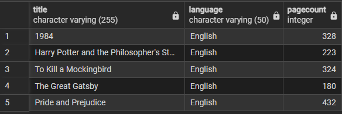

---

```sql
SELECT UserID, BookID, Score 
FROM Rating 
WHERE Score > 4.5;
```
Показує всі оцінки, більші ніж 4.5.  
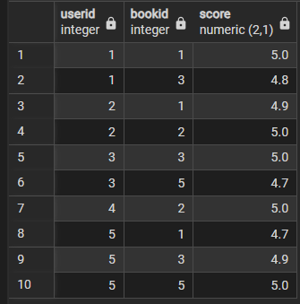

---

```sql
SELECT Title, PageCount, PublicationDate 
FROM Book 
WHERE PageCount > 300;
```
Показує книги, у яких кількість сторінок перевищує 300.  
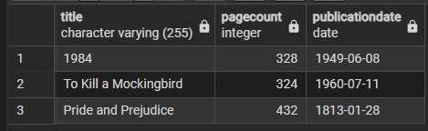

---

```sql
SELECT FullName, Country, BirthDate 
FROM Author 
WHERE Country = 'United Kingdom';
```
Показує авторів із Великої Британії.  
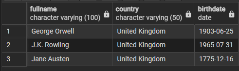

---

```sql
SELECT Name, Country, FoundedYear 
FROM Publisher 
WHERE FoundedYear > 1900;
```
Показує видавництва, засновані після 1900 року.  
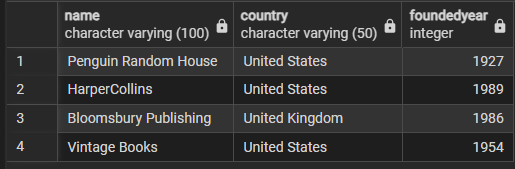

---

```sql
SELECT Title, PageCount, Language 
FROM Book 
WHERE Language = 'English' AND PageCount > 200;
```
Комбінує фільтрацію за мовою та кількістю сторінок.  
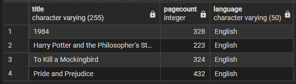

---

```sql
SELECT BookID, Score 
FROM Rating 
WHERE UserID = 1 AND Score > 4.0;
```
Показує оцінки користувача з ID=1, більші за 4.0.  
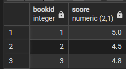

---

```sql
SELECT Name, Country 
FROM Publisher 
WHERE Country = 'United States' OR Country = 'United Kingdom';
```
Вибирає видавництва із США або Великої Британії.  
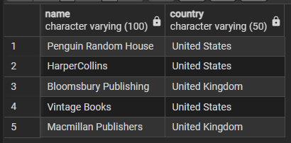

---

```sql
SELECT AVG(Score) AS "Середня оцінка" 
FROM Rating;
```
Обчислює середню оцінку всіх книг.  
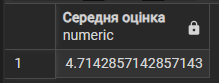

---

```sql
SELECT MAX(Score) AS "Максимальна оцінка" 
FROM Rating;
```
Показує найвищу оцінку серед усіх користувачів.  
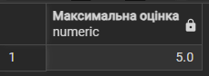

---

```sql
SELECT MIN(Score) AS "Мінімальна оцінка" 
FROM Rating;
```
Показує найнижчу оцінку в таблиці Rating.  
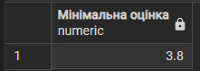

---

```sql
SELECT COUNT(*) AS "Кількість відгуків" 
FROM Review;
```
Рахує кількість відгуків у таблиці Review.  
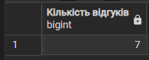

---

```sql
SELECT Title, PublicationDate 
FROM Book 
ORDER BY Title ASC;
```
Сортує книги за назвою у зростаючому порядку.  
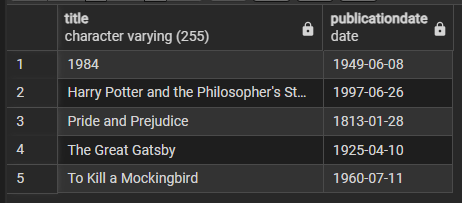

---

```sql
SELECT Title, PageCount 
FROM Book 
ORDER BY PageCount DESC;
```
Відображає книги у порядку спадання кількості сторінок.  
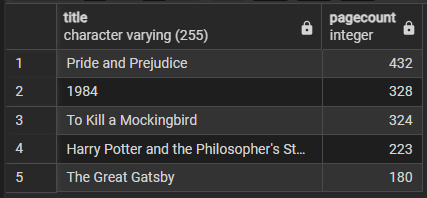

---

```sql
SELECT UserID, BookID, Score 
FROM Rating 
ORDER BY Score DESC;
```
Сортує оцінки від найвищої до найнижчої.  
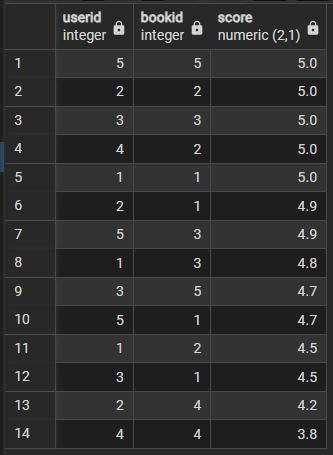

---

```sql
SELECT DISTINCT Country 
FROM Publisher;
```
Виводить список унікальних країн із таблиці Publisher.  
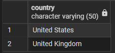

---

```sql
SELECT DISTINCT Language 
FROM Book;
```
Виводить унікальні мови книг.  
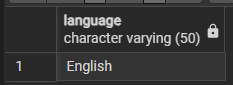

---

```sql
SELECT COUNT(DISTINCT Country) AS "Кількість країн" 
FROM Author;
```
Підраховує кількість унікальних країн серед авторів.  
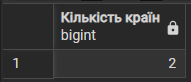

---

```sql
SELECT Title, BookID 
FROM Book 
WHERE BookID IN (1, 2, 3);
```
Показує книги з конкретними ідентифікаторами 1, 2, 3.  
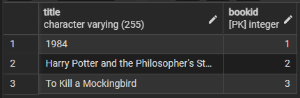

---

```sql
SELECT Title, PublicationDate 
FROM Book 
WHERE EXTRACT(YEAR FROM PublicationDate) BETWEEN 1900 AND 2000;
```
Виводить книги, опубліковані між 1900 і 2000 роками.  
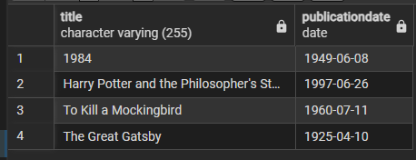

---

```sql
SELECT FullName, Country 
FROM Author 
WHERE FullName LIKE 'J%';
```
Показує авторів, чиє ім’я починається на літеру J.  
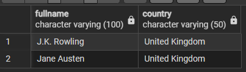

---

```sql
SELECT Username, Email 
FROM Users 
WHERE Username LIKE '%reader%';
```
Показує користувачів, у логіні яких є слово reader.  
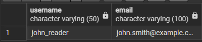

## INSERT (SELECT) → UPDATE (SELECT) → DELETE (SELECT)

Нижче наведена повна послідовність операцій `INSERT`, `UPDATE` та `DELETE`, які виконуються з використанням підзапитів `SELECT` для перевірки результатів.

```sql
INSERT INTO Users (Username, Email, Password, Nickname, AvatarURL) 
VALUES ('temp_user', 'temp.user@example.com', '$2b$12$temppassword', 'TempUser', NULL);
```
Створює тимчасового користувача для тестових операцій.

```sql
SELECT * FROM Users WHERE Username = 'temp_user';
```
Перевіряє, що користувача успішно додано.  
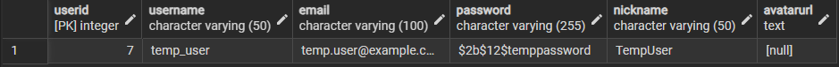

```sql
INSERT INTO Rating (UserID, BookID, Score) 
VALUES (
    (SELECT UserID FROM Users WHERE Username = 'temp_user'),
    1,
    3.5
);
```
Додає оцінку для книги `BookID = 1` від створеного користувача.

```sql
SELECT UserID, BookID, Score 
FROM Rating 
WHERE UserID = (SELECT UserID FROM Users WHERE Username = 'temp_user');
```
Перевіряє, що оцінку збережено коректно.  
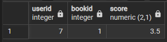

```sql
INSERT INTO Review (UserID, BookID, ReviewText, ReviewDate) 
VALUES (
    (SELECT UserID FROM Users WHERE Username = 'temp_user'),
    1,
    'This is a temporary review for testing purposes. The book is interesting but quite dark.',
    CURRENT_TIMESTAMP
);
```
Створює тестовий відгук до тієї ж книги від тимчасового користувача.

```sql
SELECT UserID, BookID, ReviewText, ReviewDate
FROM Review 
WHERE UserID = (SELECT UserID FROM Users WHERE Username = 'temp_user');
```
Підтверджує, що відгук збережено.  
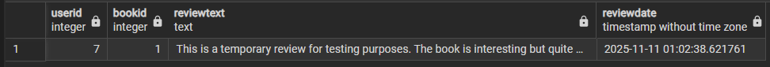

---

```sql
UPDATE Users 
SET Nickname = 'UpdatedTempUser',
    Email = 'updated.temp@example.com'
WHERE Username = 'temp_user';
```
Оновлює e-mail і нікнейм тимчасового користувача.

```sql
SELECT Username, Email, Nickname FROM Users WHERE Username = 'temp_user';
```
Перевіряє застосування змін у таблиці користувачів.  
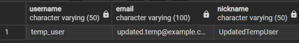

```sql
UPDATE Rating 
SET Score = 4.0 
WHERE UserID = (SELECT UserID FROM Users WHERE Username = 'temp_user')
  AND BookID = 1;
```
Підвищує оцінку користувача для книги `BookID = 1` до `4.0`.

```sql
SELECT UserID, BookID, Score 
FROM Rating 
WHERE UserID = (SELECT UserID FROM Users WHERE Username = 'temp_user');
```
Перевіряє оновлене значення оцінки.  
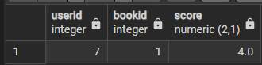

```sql
UPDATE Review 
SET ReviewText = 'Updated review: After re-reading, I appreciate this book more. The dystopian themes are very relevant.',
    LastEditDate = CURRENT_TIMESTAMP
WHERE UserID = (SELECT UserID FROM Users WHERE Username = 'temp_user')
  AND BookID = 1;
```
Оновлює текст відгуку та фіксує час останнього редагування.

```sql
SELECT UserID, ReviewText, LastEditDate
FROM Review 
WHERE UserID = (SELECT UserID FROM Users WHERE Username = 'temp_user');
```
Перевіряє, що оновлення відгуку застосовано.  
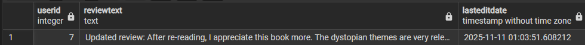

---

```sql
DELETE FROM Rating 
WHERE UserID = (SELECT UserID FROM Users WHERE Username = 'temp_user')
  AND BookID = 1;
```
Видаляє тестову оцінку користувача для книги `BookID = 1`.

```sql
SELECT * FROM Rating 
WHERE UserID = (SELECT UserID FROM Users WHERE Username = 'temp_user');
```
Переконується, що оцінку видалено.  
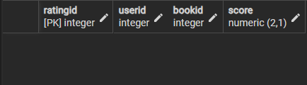

```sql
DELETE FROM Review 
WHERE UserID = (SELECT UserID FROM Users WHERE Username = 'temp_user')
  AND BookID = 1;
```
Видаляє тестовий відгук користувача до книги `BookID = 1`.

```sql
SELECT * FROM Review 
WHERE UserID = (SELECT UserID FROM Users WHERE Username = 'temp_user');
```
Переконується, що відгук видалено.  
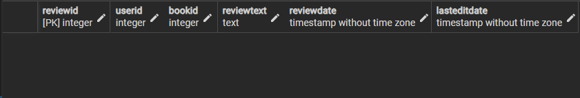

```sql
DELETE FROM Users 
WHERE Username = 'temp_user';
```
Видаляє тимчасового користувача з таблиці `Users`.

```sql
SELECT * FROM Users WHERE Username = 'temp_user';
```
Фінальна перевірка — користувач має бути відсутній.  
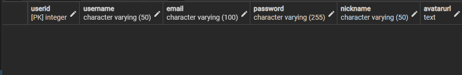
