# Лабораторна робота №4
## Аналітичні SQL-запити (OLAP)

У цій лабораторній роботі виконано набір **аналітичних SQL-запитів** до бази даних системи оцінювання книг для демонстрації можливостей агрегації, групування та об'єднання даних.

---

## Запити з агрегаційними функціями
```sql
SELECT COUNT(*) AS total_users
FROM Users;
```
Підраховує загальну кількість користувачів у системі.

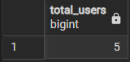

---
```sql
SELECT COUNT(*) AS "Кількість книг"
FROM Book;
```
Підраховує загальну кількість книг у базі даних.

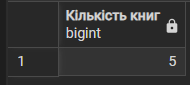

---
```sql
SELECT COUNT(*) AS "Кількість видавництв"
FROM Publisher;
```
Визначає кількість видавництв у системі.

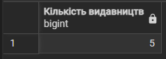

---
```sql
SELECT SUM(PageCount) AS total_pages
FROM Book;
```
Обчислює загальну кількість сторінок усіх книг.

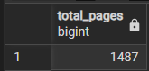

---
```sql
SELECT MAX(Score) AS max_rating
FROM Rating;
```
Знаходить найвищу оцінку серед усіх рейтингів.

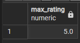

---
```sql
SELECT MIN(Score) AS "Мінімальна оцінка книги"
FROM Rating;
```
Знаходить найнижчу оцінку в таблиці рейтингів.

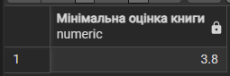

---
```sql
SELECT AVG(PageCount) AS avg_pages
FROM Book;
```
Обчислює середню кількість сторінок книг.

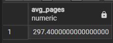

---
```sql
SELECT ROUND(AVG(Score), 2) AS "Середня оцінка книги"
FROM Rating;
```
Визначає середню оцінку всіх книг, округлену до двох знаків після коми.

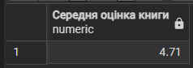

---

## Запити з GROUP BY
```sql
SELECT PublisherID, COUNT(*) AS "Кількість книг видавництва"
FROM Book
GROUP BY PublisherID;
```
Групує книги за видавництвами та підраховує їх кількість.

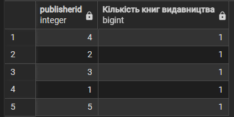

---
```sql
SELECT 
    GenreID,
    COUNT(*) AS book_count
FROM BookGenre
GROUP BY GenreID
ORDER BY book_count DESC;
```
Групує книги за жанрами та сортує за спаданням кількості.

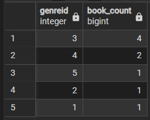

---
```sql
SELECT 
    Language,
    ROUND(AVG(PageCount), 0) AS "Середня кількість сторінок"
FROM Book
GROUP BY Language;
```
Обчислює середню кількість сторінок для кожної мови.

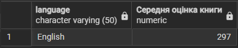

---

## Запити з HAVING
```sql
SELECT 
    BookID,
    COUNT(*) AS rating_count
FROM Rating
GROUP BY BookID
HAVING COUNT(*) > 2;
```
Відбирає книги, які мають більше двох оцінок.

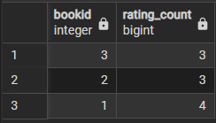

---
```sql
SELECT 
    BookID,
    AVG(Score) AS avg_rating
FROM Rating
GROUP BY BookID
HAVING AVG(Score) > 4.5;
```
Показує книги із середньою оцінкою вище 4.5.

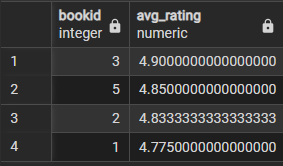

---
```sql
SELECT 
    UserID,
    COUNT(*) AS review_count
FROM Review
GROUP BY UserID
HAVING COUNT(*) > 1;
```
Відбирає користувачів, які написали більше одного відгуку.

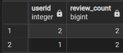

---

## Запити з JOIN
```sql
SELECT 
    b.Title,
    r.Score
FROM Book b
INNER JOIN Rating r ON b.BookID = r.BookID;
```
Об'єднує книги з їх оцінками.

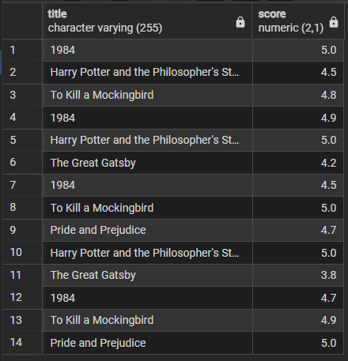

---
```sql
SELECT 
    b.Title,
    a.FullName
FROM Book b
INNER JOIN BookAuthor ba ON b.BookID = ba.BookID
INNER JOIN Author a ON ba.AuthorID = a.AuthorID;
```
Показує книги разом з їх авторами.

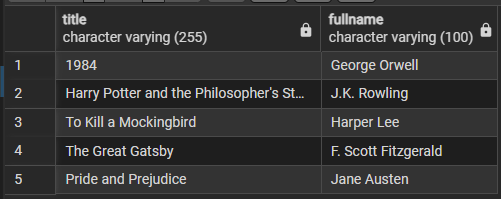

---
```sql
SELECT 
    u.Username,
    b.Title,
    rev.ReviewText
FROM Users u
INNER JOIN Review rev ON u.UserID = rev.UserID
INNER JOIN Book b ON rev.BookID = b.BookID;
```
Виводить користувачів з їх відгуками та назвами книг.

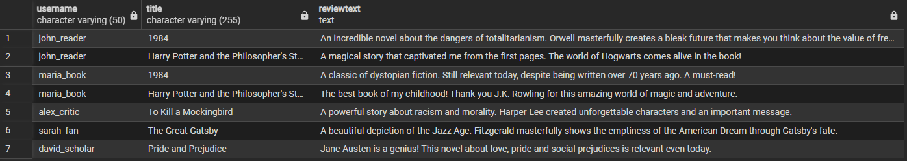

---
```sql
SELECT 
    b.Title,
    p.Name AS publisher
FROM Book b
LEFT JOIN Publisher p ON b.PublisherID = p.PublisherID;
```
Показує всі книги з видавництвами, включаючи книги без видавництва.

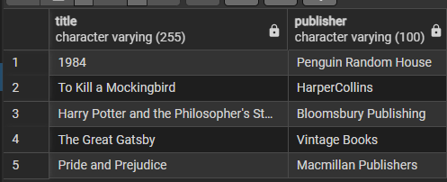

---
```sql
SELECT 
    u.Username,
    COUNT(r.RatingID) AS rating_count
FROM Users u
LEFT JOIN Rating r ON u.UserID = r.UserID
GROUP BY u.UserID, u.Username;
```
Підраховує кількість оцінок для кожного користувача.

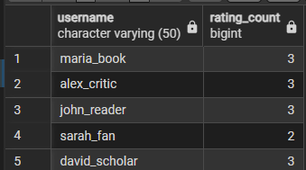

---
```sql
SELECT 
    b.Title,
    COUNT(r.RatingID) AS rating_count
FROM Book b
LEFT JOIN Rating r ON b.BookID = r.BookID
GROUP BY b.BookID, b.Title;
```
Визначає кількість оцінок для кожної книги.

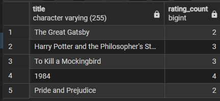

---

## Запити з підзапитами
```sql
SELECT Title
FROM Book
WHERE BookID IN (
    SELECT BookID
    FROM Rating
    GROUP BY BookID
    HAVING AVG(Score) > (SELECT AVG(Score) FROM Rating)
);
```
Знаходить книги з оцінкою вище середньої.

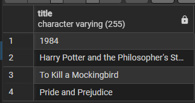

---
```sql
SELECT Username
FROM Users
WHERE UserID IN (
    SELECT UserID
    FROM Rating
    WHERE Score = (SELECT MAX(Score) FROM Rating)
);
```
Показує користувачів, які поставили найвищу оцінку.

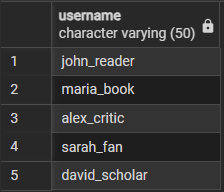

---
```sql
SELECT FullName
FROM Author
WHERE AuthorID IN (
    SELECT AuthorID
    FROM BookAuthor
);
```
Виводить авторів, які мають книги в системі.

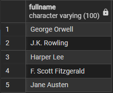