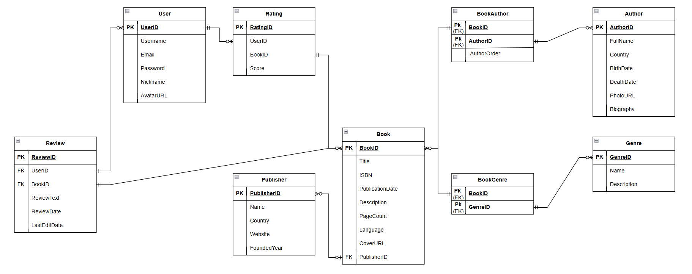

# Лабораторна робота №5
## Нормалізація бази даних

У цій лабораторній роботі виконано **аналіз нормалізації** бази даних системи оцінювання книг (**Book Rating System**). Проаналізовано функціональні залежності, визначено нормальні форми для кожної таблиці та перевірено відсутність аномалій оновлення, вставки та видалення.

---

## Результати коротко

**База даних вже знаходиться в 3NF (Третій Нормальній Формі)!**

Схема спроектована правильно з самого початку, тому **жодних змін не потрібно**.

---

## Теоретична частина: Нормальні форми

### 1. Перша Нормальна Форма (1NF)

**Визначення:** Таблиця знаходиться в 1NF, якщо:
- Всі атрибути містять атомарні (неподільні) значення
- Немає повторюваних груп
- Є первинний ключ

### 2. Друга Нормальна Форма (2NF)

**Визначення:** Таблиця знаходиться в 2NF, якщо:
- Вона знаходиться в 1NF
- Всі неключові атрибути повністю функціонально залежні від первинного ключа (немає часткових залежностей)

### 3. Третя Нормальна Форма (3NF)

**Визначення:** Таблиця знаходиться в 3NF, якщо:
- Вона знаходиться в 2NF
- Немає транзитивних залежностей (неключові атрибути не залежать від інших неключових атрибутів)

---

## Функціональні залежності та аналіз таблиць

### 1. Таблиця Users

**Структура:**
```sql
CREATE TABLE Users (
    UserID SERIAL PRIMARY KEY,
    Username VARCHAR(50) NOT NULL UNIQUE,
    Email VARCHAR(100) NOT NULL UNIQUE CHECK (Email LIKE '%@%'),
    Password VARCHAR(255) NOT NULL,
    Nickname VARCHAR(50),
    AvatarURL TEXT
);
```

**Функціональні залежності:**
```
UserID → Username, Email, Password, Nickname, AvatarURL
Username → UserID, Email, Password, Nickname, AvatarURL
Email → UserID, Username, Password, Nickname, AvatarURL
```

**Аналіз нормальних форм:**

| Форма | Статус | Пояснення |
|-------|--------|-----------|
| 1NF | ✅ | Всі атрибути атомарні, немає повторюваних груп |
| 2NF | ✅ | Первинний ключ простий (UserID), часткових залежностей немає |
| 3NF | ✅ | Неключові атрибути залежать тільки від UserID, транзитивних залежностей немає |

**Висновок:** Таблиця знаходиться в **3NF** ✅

---

### 2. Таблиця Publisher

**Структура:**
```sql
CREATE TABLE Publisher (
    PublisherID SERIAL PRIMARY KEY,
    Name VARCHAR(100) NOT NULL,
    Country VARCHAR(50),
    Website TEXT,
    FoundedYear INT CHECK (FoundedYear >= 1450 AND FoundedYear <= EXTRACT(YEAR FROM CURRENT_DATE))
);
```

**Функціональні залежності:**
```
PublisherID → Name, Country, Website, FoundedYear
```

**Аналіз нормальних форм:**

| Форма | Статус | Пояснення |
|-------|--------|-----------|
| 1NF | ✅ | Всі атрибути атомарні |
| 2NF | ✅ | Первинний ключ простий |
| 3NF | ✅ | Немає транзитивних залежностей між неключовими атрибутами |

**Висновок:** Таблиця знаходиться в **3NF** ✅

---

### 3. Таблиця Author

**Структура:**
```sql
CREATE TABLE Author (
    AuthorID SERIAL PRIMARY KEY,
    FullName VARCHAR(100) NOT NULL,
    Country VARCHAR(50),
    BirthDate DATE,
    DeathDate DATE CHECK (DeathDate IS NULL OR DeathDate >= BirthDate),
    PhotoURL TEXT,
    Biography TEXT
);
```

**Функціональні залежності:**
```
AuthorID → FullName, Country, BirthDate, DeathDate, PhotoURL, Biography
```

**Аналіз нормальних форм:**

| Форма | Статус | Пояснення |
|-------|--------|-----------|
| 1NF | ✅ | Всі атрибути атомарні |
| 2NF | ✅ | Первинний ключ простий |
| 3NF | ✅ | Всі неключові атрибути залежать безпосередньо від AuthorID |

**Висновок:** Таблиця знаходиться в **3NF** ✅

---

### 4. Таблиця Genre

**Структура:**
```sql
CREATE TABLE Genre (
    GenreID SERIAL PRIMARY KEY,
    Name VARCHAR(50) NOT NULL UNIQUE,
    Description TEXT
);
```

**Функціональні залежності:**
```
GenreID → Name, Description
Name → GenreID, Description (альтернативний ключ)
```

**Аналіз нормальних форм:**

| Форма | Статус | Пояснення |
|-------|--------|-----------|
| 1NF | ✅ | Всі атрибути атомарні |
| 2NF | ✅ | Первинний ключ простий |
| 3NF | ✅ | Description залежить тільки від GenreID |

**Висновок:** Таблиця знаходиться в **3NF** ✅

---

### 5. Таблиця Book

**Структура:**
```sql
CREATE TABLE Book (
    BookID SERIAL PRIMARY KEY,
    Title VARCHAR(255) NOT NULL,
    ISBN VARCHAR(17) UNIQUE,
    PublicationDate DATE,
    Description TEXT,
    PageCount INT CHECK (PageCount > 0),
    Language VARCHAR(50) NOT NULL DEFAULT 'English',
    CoverURL TEXT,
    PublisherID INT REFERENCES Publisher(PublisherID) ON DELETE SET NULL
);
```

**Функціональні залежності:**
```
BookID → Title, ISBN, PublicationDate, Description, PageCount, Language, CoverURL, PublisherID
ISBN → BookID, Title, PublicationDate, Description, PageCount, Language, CoverURL, PublisherID
```

**Аналіз нормальних форм:**

| Форма | Статус | Пояснення |
|-------|--------|-----------|
| 1NF | ✅ | Всі атрибути атомарні |
| 2NF | ✅ | Первинний ключ простий |
| 3NF | ✅ | PublisherID - це FK (посилання). Інформація про видавництво в окремій таблиці |

**Висновок:** Таблиця знаходиться в **3NF** ✅

---

### 6. Таблиця Rating

**Структура:**
```sql
CREATE TABLE Rating (
    RatingID SERIAL PRIMARY KEY,
    UserID INT NOT NULL REFERENCES Users(UserID) ON DELETE CASCADE,
    BookID INT NOT NULL REFERENCES Book(BookID) ON DELETE CASCADE,
    Score NUMERIC(2,1) NOT NULL CHECK (Score >= 1.0 AND Score <= 5.0),
    UNIQUE(UserID, BookID)
);
```

**Функціональні залежності:**
```
RatingID → UserID, BookID, Score
(UserID, BookID) → Score, RatingID (альтернативний ключ)
```

**Аналіз нормальних форм:**

| Форма | Статус | Пояснення |
|-------|--------|-----------|
| 1NF | ✅ | Всі атрибути атомарні |
| 2NF | ✅ | Первинний ключ простий (RatingID) |
| 3NF | ✅ | Score залежить безпосередньо від RatingID |

**Висновок:** Таблиця знаходиться в **3NF** ✅

---

### 7. Таблиця Review

**Структура:**
```sql
CREATE TABLE Review (
    ReviewID SERIAL PRIMARY KEY,
    UserID INT NOT NULL REFERENCES Users(UserID) ON DELETE CASCADE,
    BookID INT NOT NULL REFERENCES Book(BookID) ON DELETE CASCADE,
    ReviewText TEXT NOT NULL CHECK (LENGTH(ReviewText) BETWEEN 10 AND 5000),
    ReviewDate TIMESTAMP NOT NULL DEFAULT CURRENT_TIMESTAMP,
    LastEditDate TIMESTAMP,
    UNIQUE(UserID, BookID)
);
```

**Функціональні залежності:**
```
ReviewID → UserID, BookID, ReviewText, ReviewDate, LastEditDate
(UserID, BookID) → ReviewText, ReviewDate, LastEditDate, ReviewID
```

**Аналіз нормальних форм:**

| Форма | Статус | Пояснення |
|-------|--------|-----------|
| 1NF | ✅ | Всі атрибути атомарні |
| 2NF | ✅ | Первинний ключ простий (ReviewID) |
| 3NF | ✅ | Всі неключові атрибути залежать безпосередньо від ReviewID |

**Висновок:** Таблиця знаходиться в **3NF** ✅

---

### 8. Таблиця BookAuthor (Junction Table)

**Структура:**
```sql
CREATE TABLE BookAuthor (
    BookID INT NOT NULL REFERENCES Book(BookID) ON DELETE CASCADE,
    AuthorID INT NOT NULL REFERENCES Author(AuthorID) ON DELETE CASCADE,
    AuthorOrder INT NOT NULL CHECK (AuthorOrder > 0),
    PRIMARY KEY (BookID, AuthorID)
);
```

**Функціональні залежності:**
```
(BookID, AuthorID) → AuthorOrder
```

**Аналіз нормальних форм:**

| Форма | Статус | Пояснення |
|-------|--------|-----------|
| 1NF | ✅ | Всі атрибути атомарні |
| 2NF | ✅ | AuthorOrder залежить від УСЬОГО складеного ключа (BookID, AuthorID) |
| 3NF | ✅ | Є лише один неключовий атрибут, транзитивних залежностей немає |

**Призначення:** Junction table для реалізації відношення багато-до-багатьох (M:N) між книгами та авторами. Одна книга може мати багато авторів, один автор може написати багато книг.

**Висновок:** Таблиця знаходиться в **3NF** ✅

---

### 9. Таблиця BookGenre (Junction Table)

**Структура:**
```sql
CREATE TABLE BookGenre (
    BookID INT NOT NULL REFERENCES Book(BookID) ON DELETE CASCADE,
    GenreID INT NOT NULL REFERENCES Genre(GenreID) ON DELETE CASCADE,
    PRIMARY KEY (BookID, GenreID)
);
```

**Функціональні залежності:**
```
(BookID, GenreID) → ∅ (немає додаткових атрибутів)
```

**Аналіз нормальних форм:**

| Форма | Статус | Пояснення |
|-------|--------|-----------|
| 1NF | ✅ | Всі атрибути атомарні |
| 2NF | ✅ | Немає неключових атрибутів |
| 3NF | ✅ | Немає неключових атрибутів |

**Призначення:** Найпростіша форма junction table - містить лише два FK. Реалізує відношення M:N між книгами та жанрами.

**Висновок:** Таблиця знаходиться в **3NF** ✅

---

**Переваги junction table:**
- Інформація про автора зберігається один раз
- Легко додавати/видаляти авторів
- Підтримується порядок авторів (AuthorOrder)

---

## Підсумкова таблиця нормалізації

| Таблиця | 1NF | 2NF | 3NF | Коментар |
|---------|:---:|:---:|:---:|----------|
| Users | ✅ | ✅ | ✅ | Прості атрибути, простий ключ |
| Publisher | ✅ | ✅ | ✅ | Окрема таблиця для видавництв |
| Author | ✅ | ✅ | ✅ | Окрема таблиця для авторів |
| Genre | ✅ | ✅ | ✅ | Окрема таблиця для жанрів |
| Book | ✅ | ✅ | ✅ | Тільки FK на Publisher, не дублює дані |
| Rating | ✅ | ✅ | ✅ | Простий PK, зв'язок User + Book |
| Review | ✅ | ✅ | ✅ | Простий PK, зв'язок User + Book |
| BookAuthor | ✅ | ✅ | ✅ | Junction table для M:N (Book ↔ Author) |
| BookGenre | ✅ | ✅ | ✅ | Junction table для M:N (Book ↔ Genre) |

**Загальний висновок:** Всі 9 таблиць знаходяться в **3NF** ✅

---

## Структура бази даних

### ER-діаграма



### Опис зв'язків

[Опис зв’язків між таблицями](../Lab_1/README.md#3-опис-звязків)

### SQL-код

 
[Повний SQL-код створених таблиць](../Lab_2/book_rating.sql)

---

## Переваги нормалізованої схеми

### Мінімізація надмірності
- Кожен факт зберігається **один раз**
- Немає дублювання інформації
- Менше використання дискового простору

### Усунення аномалій
- Аномалія оновлення: зміни в одному місці
- Аномалія видалення: каскадне видалення працює правильно
- Аномалія вставки: можна додавати сутності незалежно

### Цілісність даних
- Зовнішні ключі забезпечують консистентність
- CHECK constraints валідують дані
- UNIQUE constraints уникають дублікатів

### Гнучкість
- Легко додавати нові атрибути
- Просто змінювати структуру
- Зрозуміла для підтримки
