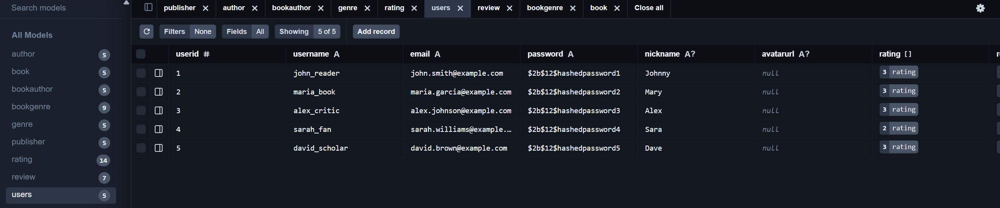
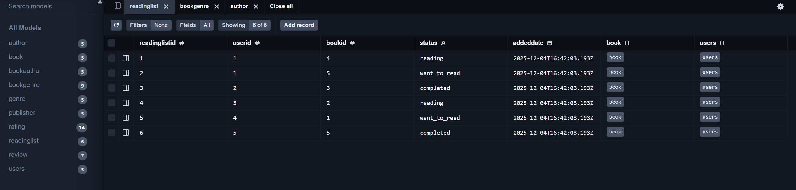
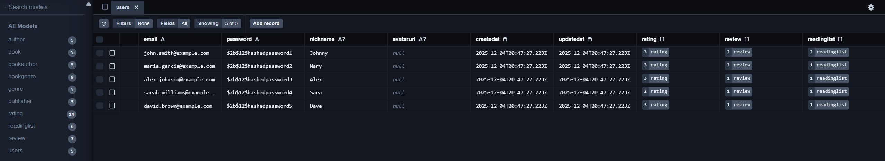
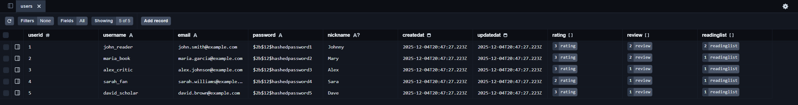

# Лабораторна робота №6

## Міграції схем за допомогою Prisma ORM

У цій лабораторній роботі виконано серію міграцій схеми бази даних **Book Rating System** з використанням **Prisma ORM**. Робота демонструє процес еволюції структури бази даних через контрольовані міграції.

---

## Початкова міграція: `init`

**Опис:** Імпорт існуючої схеми бази даних з PostgreSQL до Prisma за допомогою команди `npx prisma db pull`. Створено початкову схему Prisma, що відображає всі таблиці з Лабораторної роботи 5.

**Команда виконання:**

```bash
npx prisma db pull
npx prisma migrate dev --name init
```

**Результат:** Створено базову схему `schema.prisma` з моделями: `Users`, `Publisher`, `Author`, `Book`, `Genre`, `BookAuthor`, `BookGenre`, `Rating`, `Review`.



---

## Міграція 1: `add_reading_list_table`

**Опис:** Додано нову таблицю `ReadingList` для відстеження списків читання користувачів. Таблиця містить зв'язок "багато-до-багатьох" між користувачами та книгами зі статусом прочитання.

**Зміни в `schema.prisma`:**

```prisma
// Додано нову модель
model readinglist {
  readinglistid Int      @id @default(autoincrement())
  userid        Int
  bookid        Int
  status        String   @db.VarChar(20)
  addeddate     DateTime @default(now()) @db.Timestamp(6)
  book          book     @relation(fields: [bookid], references: [bookid], onDelete: Cascade, onUpdate: NoAction)
  users         users    @relation(fields: [userid], references: [userid], onDelete: Cascade, onUpdate: NoAction)

  @@unique([userid, bookid])
}

// У моделі users додано:
readinglist readinglist[]

// У моделі book додано:
readinglist readinglist[]
```

**Згенерований `migration.sql`:**

```sql
-- CreateTable
CREATE TABLE "readinglist" (
    "readinglistid" SERIAL NOT NULL,
    "userid" INTEGER NOT NULL,
    "bookid" INTEGER NOT NULL,
    "status" VARCHAR(20) NOT NULL,
    "addeddate" TIMESTAMP(6) NOT NULL DEFAULT CURRENT_TIMESTAMP,

    CONSTRAINT "readinglist_pkey" PRIMARY KEY ("readinglistid")
);

-- CreateIndex
CREATE UNIQUE INDEX "readinglist_userid_bookid_key" ON "readinglist"("userid", "bookid");

-- AddForeignKey
ALTER TABLE "readinglist" ADD CONSTRAINT "readinglist_bookid_fkey"
    FOREIGN KEY ("bookid") REFERENCES "book"("bookid")
    ON DELETE CASCADE ON UPDATE NO ACTION;

-- AddForeignKey
ALTER TABLE "readinglist" ADD CONSTRAINT "readinglist_userid_fkey"
    FOREIGN KEY ("userid") REFERENCES "users"("userid")
    ON DELETE CASCADE ON UPDATE NO ACTION;
```



---

## Міграція 2: `add_timestamps_to_users`

**Опис:** Додано поля `CreatedAt` та `UpdatedAt` до таблиці `Users` для відстеження часу створення та оновлення записів користувачів.

**Зміни в `schema.prisma`:**

```prisma
model users {
  userid      Int           @id @default(autoincrement())
  username    String        @unique @db.VarChar(50)
  email       String        @unique @db.VarChar(100)
  password    String        @db.VarChar(255)
  nickname    String?       @db.VarChar(50)
  avatarurl   String?
  createdat   DateTime      @default(now()) @db.Timestamp(6)  // Додано
  updatedat   DateTime      @updatedAt @db.Timestamp(6)       // Додано
  rating      rating[]
  readinglist readinglist[]
  review      review[]
}
```

**Згенерований `migration.sql`:**

```sql
-- AlterTable
ALTER TABLE "users"
ADD COLUMN "createdat" TIMESTAMP(6) NOT NULL DEFAULT CURRENT_TIMESTAMP,
ADD COLUMN "updatedat" TIMESTAMP(6) NOT NULL;
```



---

## Міграція 3: `remove_avatar_url_from_users`

**Опис:** Видалено поле `AvatarURL` з таблиці `Users`, оскільки прийнято рішення зберігати аватари у зовнішньому сховищі.

**Зміни в `schema.prisma`:**

```prisma
model users {
  userid      Int           @id @default(autoincrement())
  username    String        @unique @db.VarChar(50)
  email       String        @unique @db.VarChar(100)
  password    String        @db.VarChar(255)
  nickname    String?       @db.VarChar(50)
  // avatarurl видалено
  createdat   DateTime      @default(now()) @db.Timestamp(6)
  updatedat   DateTime      @updatedAt @db.Timestamp(6)
  rating      rating[]
  readinglist readinglist[]
  review      review[]
}
```

**Згенерований `migration.sql`:**

```sql
-- AlterTable
ALTER TABLE "users" DROP COLUMN "avatarurl";
```



---

## Seed-скрипт для наповнення бази даних

Створено `seed.ts` для автоматичного наповнення бази даних тестовими даними:

```typescript
import { PrismaClient } from "@prisma/client";

const prisma = new PrismaClient();

async function main() {
  console.log("Starting database seeding...");

  // Очищення бази даних
  await prisma.review.deleteMany();
  await prisma.readinglist.deleteMany();
  await prisma.rating.deleteMany();
  await prisma.bookauthor.deleteMany();
  await prisma.bookgenre.deleteMany();
  await prisma.book.deleteMany();
  await prisma.genre.deleteMany();
  await prisma.author.deleteMany();
  await prisma.publisher.deleteMany();
  await prisma.users.deleteMany();

  console.log("Database cleaned");

  // Створення користувачів
  await prisma.users.createMany({
    data: [
      {
        userid: 1,
        username: "john_reader",
        email: "john.smith@example.com",
        password: "$2b$12$hashedpassword1",
        nickname: "Johnny",
      },
      {
        userid: 2,
        username: "maria_book",
        email: "maria.garcia@example.com",
        password: "$2b$12$hashedpassword2",
        nickname: "Mary",
      },
      // ... інші користувачі
    ],
  });

  // Створення видавництв
  await prisma.publisher.createMany({
    data: [
      {
        publisherid: 1,
        name: "Penguin Random House",
        country: "United States",
        website: "https://penguinrandomhouse.com",
        foundedyear: 1927,
      },
      // ... інші видавництва
    ],
  });

  // Створення авторів
  await prisma.author.createMany({
    data: [
      {
        authorid: 1,
        firstname: "George",
        middlename: null,
        lastname: "Orwell",
        country: "United Kingdom",
        birthdate: new Date("1903-06-25"),
        deathdate: new Date("1950-01-21"),
        biography: "English novelist, essayist, journalist, and critic...",
      },
      // ... інші автори
    ],
  });

  // Створення жанрів, книг, рейтингів, відгуків та списків читання
  // ...

  // Скидання послідовностей
  const tables = [
    { name: "users", pk: "userid" },
    { name: "publisher", pk: "publisherid" },
    { name: "author", pk: "authorid" },
    { name: "genre", pk: "genreid" },
    { name: "book", pk: "bookid" },
    { name: "rating", pk: "ratingid" },
    { name: "review", pk: "reviewid" },
    { name: "readinglist", pk: "readinglistid" },
  ];

  for (const table of tables) {
    await prisma.$executeRawUnsafe(
      `SELECT setval(pg_get_serial_sequence('"${table.name}"', '${table.pk}'), 
       coalesce(max("${table.pk}")+1, 1), false) FROM "${table.name}";`
    );
  }

  console.log("Seeding finished successfully!");
}

main()
  .then(async () => {
    await prisma.$disconnect();
  })
  .catch(async (e) => {
    console.error(e);
    await prisma.$disconnect();
    process.exit(1);
  });
```

**Команда виконання:**

```bash
npx tsx prisma/seed.ts
```

## Корисні команди Prisma

```bash
# Ініціалізація Prisma у проекті
npm init -y
npm install prisma --save-dev
npx prisma init --datasource-provider postgresql

# Імпорт існуючої схеми з БД
npx prisma db pull

# Створення та застосування міграції
npx prisma migrate dev --name migration_name

# Перегляд стану міграцій
npx prisma migrate status

# Запуск Prisma Studio
npx prisma studio

# Генерація Prisma Client
npx prisma generate

# Наповнення бази даних
npx tsx prisma/seed.ts

# Скидання бази даних (УВАГА: видаляє всі дані!)
npx prisma migrate reset
```
